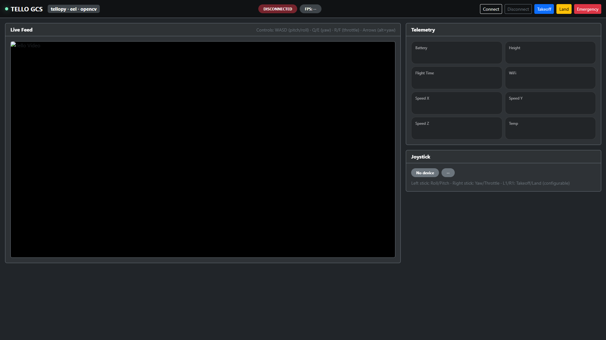

# Tello-GCS (DJI Tello Ground Control Station)


A modern, lightweight **Ground Control Station (GCS)** for **DJI Tello** built with **Python + Web UI**.  
It provides **live video streaming**, **telemetry dashboard**, and **USB joystick flight control**, using a clean modular architecture that keeps drone logic, UI, video, and input systems separated.

 

## Features

- **Live video feed** from Tello (PyAV decoding) with **OpenCV HUD overlay**
- **Real-time telemetry** (battery, altitude, flight time, speed, Wi-Fi, temperature where available)
- **USB joystick control** (PS/Xbox/USB controllers) via `pygame`
- **Modern Bootstrap UI** rendered locally via **Eel** (Python ↔ JavaScript bridge)
- **Modular codebase**: Drone, video, HUD, joystick, and UI bridge are isolated into separate modules
- Designed to be **extendable** (CV modes, recording, mission scripting, PID/expo tuning, mapping calibration)


## Tech Stack

- **Python** (core runtime)
- **tellopy** (DJI Tello control + telemetry + video stream)
- **PyAV** (`av`) (reliable H.264 decoding from Tello video stream)
- **OpenCV** (HUD overlay + computer vision pipeline)
- **Eel** (Python ↔ Web UI communication + app window)
- **Bootstrap 5** (modern responsive UI)
- **pygame** (USB joystick input)


## Project Structure

```bash
Tello-GCS/
    - main.py
gcs/
    - **init**.py
    - config.py        # All tunable parameters (FPS, joystick mappings, scaling)
    - state.py         # Shared state container (telemetry + joystick + flags)
    - hud.py           # Pure HUD drawing (OpenCV overlay)
    - drone.py         # Drone controller (connect/disconnect, RC, telemetry callback)
    - video.py         # Video decode loop (PyAV -> OpenCV -> UI)
    - joystick.py      # Joystick loop (pygame -> RC)
    - ui_bridge.py     # Eel exposed API + background pushers
web/
    - index.html       # Bootstrap UI layout
styles/
    - style.css # Small styling on top of Bootstrap
src/
    - script.js    # UI logic (connect buttons + frame/telemetry updates)

````


## Installation

> Recommended: use a virtual environment.

```bash
python -m venv tello-venv
# Windows:
tello-venv\Scripts\activate
# macOS/Linux:
source tello-venv/bin/activate
````

Install dependencies:

```bash
pip install -r requirements.txt
```


## Running the GCS

1. Power on the DJI Tello
2. Connect your PC to the **Tello Wi-Fi**
3. Start the app:

```bash
python main.py
```

4. In the UI, click **Connect**
5. Use a **USB joystick** for control (if connected)


## Controls

### Joystick (Default)

Typical controller mapping (can vary by device):

* **Left stick**: Roll / Pitch
* **Right stick**: Yaw / Throttle
* Optional buttons:

  * **L1**: Takeoff
  * **R1**: Land

> Axis indices and buttons are configurable in `gcs/config.py`.


## Configuration

All runtime tuning is centralized in:

* `gcs/config.py`

### Video tuning

* `FRAME_W`, `FRAME_H`
* `FPS_LIMIT`
* `JPEG_QUALITY`

### Joystick tuning

* `JOY_DEADZONE` — ignore tiny stick noise
* `JOY_EXPO` — softer center response
* `JOY_MAX_CMD` — scale output command strength
* `JOY_RATE_HZ` — how often RC is pushed to the drone
* `JOY_AXIS_*` and `JOY_BTN_*` — per-controller mapping


## Architecture Overview

### Data flow

* **DroneController (`drone.py`)**

  * Connects to Tello
  * Subscribes to flight telemetry callbacks
  * Provides RC control interface (`rc()`)

* **Video loop (`video.py`)**

  * Pulls Tello video stream
  * Decodes frames with PyAV
  * Renders HUD via `hud.py`
  * Pushes frames into the UI via Eel

* **Joystick loop (`joystick.py`)**

  * Reads joystick axes/buttons via pygame
  * Applies deadzone + expo + scaling
  * Continuously calls `drone.rc(...)`

* **UI Bridge (`ui_bridge.py`)**

  * Defines Eel-exposed functions (`ui_connect`, `ui_disconnect`, etc.)
  * Pushes telemetry updates to the web UI on an interval
  * Starts/stops background threads cleanly

* **Shared state (`state.py`)**

  * Holds telemetry + status in a thread-safe container
  * Provides `to_dict()` for direct UI serialization


## Extending the Project

This structure is intentionally designed to be easy to extend:

* Add CV modes in `hud.py` or separate `cv_modes/` module:

  * Object tracking
  * Marker detection (landing pad)
  * Motion vectors / optical flow

* Add recording support in `video.py`:

  * Save processed frames
  * Raw stream capture

* Add calibration tools:

  * Joystick mapping UI
  * Deadzone/expo sliders in the web dashboard

* Add mission scripting:

  * Predefined maneuvers (square, orbit)
  * Timed macro commands


## Notes / Limitations

* **tellopy API** uses `set_roll/set_pitch/set_yaw/set_throttle` for RC control (continuous control model).
* Telemetry fields may vary depending on tellopy version and Tello firmware.
* Video decoding can throw startup errors on the first packets; the video loop is designed to handle this gracefully.


## License

Specify your license here (MIT/Apache-2.0/etc.)


## Credits

* DJI Tello community and open-source ecosystem:

  * tellopy
  * Eel
  * PyAV
  * OpenCV
  * Bootstrap
  * pygame
